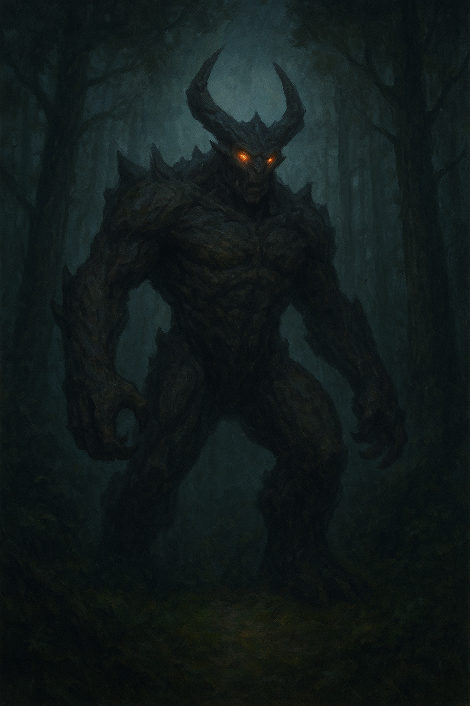

# 🌲 Forest Encounter — Guided by the Elder

The mist parts slightly as you follow the flickering light Elder Merin spoke of. The forest feels alive — every leaf shivers, and shadows stretch unnaturally. The smell of damp earth mixes with the faint aroma of herbs you recognize from the elder’s cottage. You feel **prepared**, carrying her charm and remembering her warnings.  

A low growl rumbles through the trees. From the gloom, the guardian steps forward, eyes blazing like molten fire. Its massive frame is both terrifying and majestic, muscles rippling beneath dark, bark-like skin.  

> “Ah… you return,” the guardian says, voice echoing through the mist.  
> “Prepared this time, are you? Let us see if courage is matched with wisdom.”  

You clutch the charm the elder gave you. A faint blue glow emanates from it, strengthening your resolve. The guardian circles, studying your stance.

---

## 🛡️ What will you do?

- 🤝 [Try to **befriend** the guardian](secret-map.md)  
*You speak gently, holding the elder’s charm forward. The guardian pauses, sniffing the air. After a tense moment, it inclines its head and gestures toward a faintly glowing clearing deeper in the forest.*  
*You discover a **fragment of the secret map** here, guiding your next steps.*

- 🌌 [Follow the **glowing area** beyond the trees](glowing-area.md)  
*The faint light the elder mentioned shimmers through the fog. Guided by her charm, you approach cautiously. The clearing opens to reveal magical glyphs etched into stones — a sign that you are on the right path.*