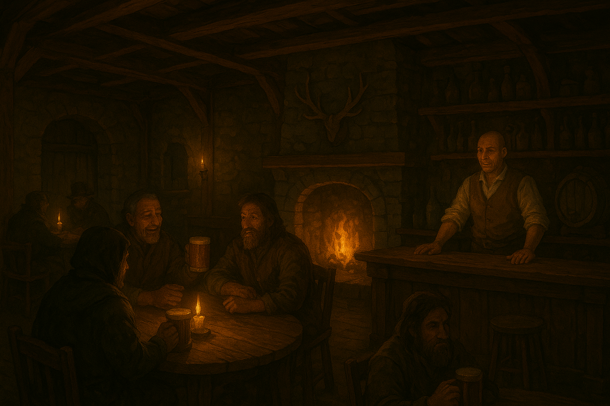

# 🍺 The Silver Lantern Tavern

Warm light spills from the doorway of the **Silver Lantern Tavern**, though the glow feels weaker than you remember. Inside, laughter mixes with the scent of smoke and spiced ale. The townsfolk speak in low voices, glancing at the dark windows.

You slide onto a stool as the barkeep eyes you warily.

>"You're asking about the Lantern?" he mutters. "Then you'd best hurry. The guards have questions too - and not the friendly kind."

He nods toward a narrow stairwell behind the bar.  
At the same time, a group of miners at a nearby table whisper urgently, shoving a small, glowing crystal into a pouch.

> “Found it deep below,” one says. “Didn’t belong to this world.”

The tavern suddenly feels much quieter. Eyes turn toward you, waiting to see what you'll do.

---

## 💬 What will you do?

- 🔦 [Descend into the tavern cellar](cellar-secret.md)  
*The barkeep’s warning echoes in your mind as you lift the trapdoor.*  

- 🍺 [Drink some beer](start.md)  
*You could drink this stuff for hours.*

- ⬅️ [Return to the crossroads](start.md)  
*You might gather more clues elsewhere before making your move.*