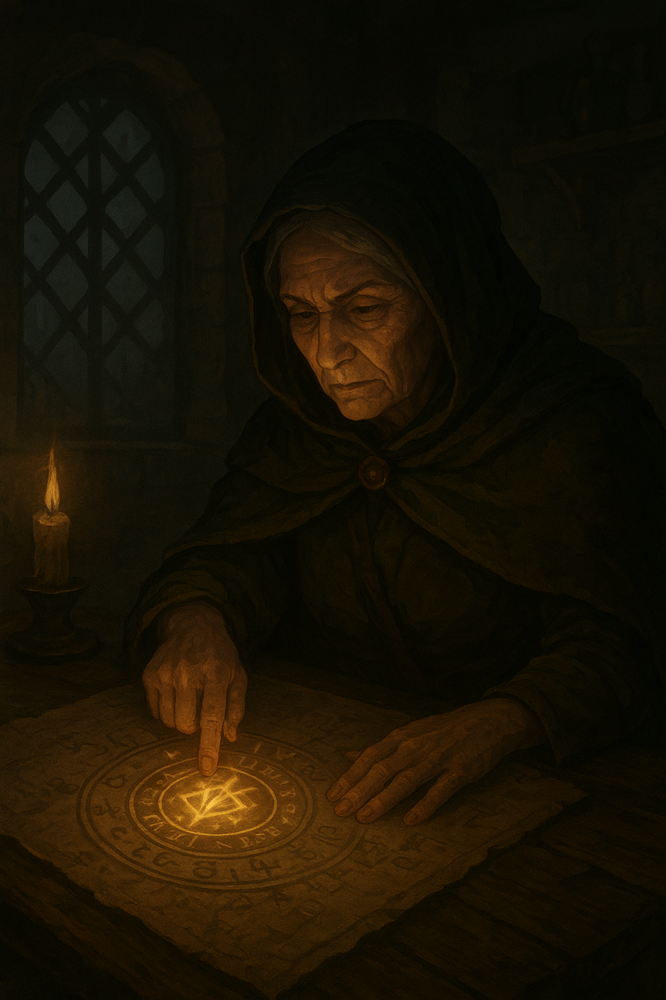

# 🧓 Meeting the Elder

The cottage of **Elder Merin** stands crooked at the far edge of Lirien, half-buried beneath vines that glow faintly in the twilight. The air smells of rosemary and smoke. You knock once — the door swings open by itself.

Inside, shelves sag under the weight of bottles and bones, and a single blue lantern flickers weakly on the table.  
The elder’s eyes lift to meet yours, sharp and knowing.

> “So… the Lantern’s heart fades, does it?” she murmurs.  
> “It’s been calling to those with courage — or foolishness.”

She gestures to an old parchment covered in spiraling runes. One symbol pulses faintly when your hand nears it.

> “That mark,” Merin says, “belongs to the one who *stole* the flame. If you follow it, you may find the truth… or be consumed by it.”

You hear a faint hum from the forest beyond her window — a light flickering through the trees.

---

## 🌙 What will you do?

- 🔮[Study the glowing rune more closely](rune-discovery.md)  
*perhaps you can uncover its power before it fades.*

- 🌲[Leave the cottage and follow the light into the forest](forest-path.md)  
*It could lead you to the thief - or to something much worse.*  

- ⬅️ [Return to the crossroads](start.md)  
*Maybe the answers lie elsewhere for now.*