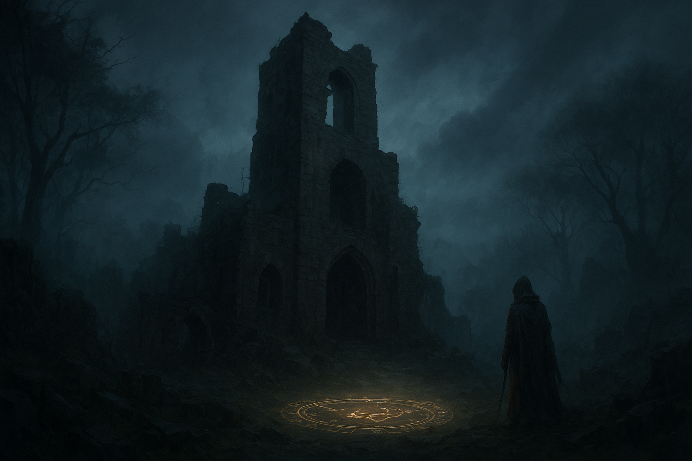

# 🏰 The Ruined Tower

You leave the safety of the village and climb the narrow ridge toward the **Old Watchwoer**. Its silhouette looms above the mist - once a beacn of light, now little more than a jagged ruin. The path is lined with fallen stones and tangled ivy.

Inside, the air crackles faintly with energy.  
A broken lantern lies at the center of the floor, surrounded by glowing runes — the same symbol you saw in the elder’s cottage.

> “So… another seeker comes,” a voice whispers.

From the shadows steps a hooded figure, holding a shard of radiant light that seems alive. Their tone is both mocking and mournful.

> “The heart of Lirien doesn’t belong to your kind anymore.”

The runes beneath your feet start to flicker — a spell awakening.

 

---

## 🕯️ What will you do?

- ⚔️ [Confront the mysterious figure](confront-figure.md)  
*You draw your blade, the air trembling with power.*  

- 🪶 [Speak calmly and ask what they mean](speak-to-shadow.md)  
  *Perhaps there’s truth hidden behind their bitterness.*  

- ⬅️ [Retreat and return to the crossroads](start.md)  
  *You need to prepare before facing them again.*